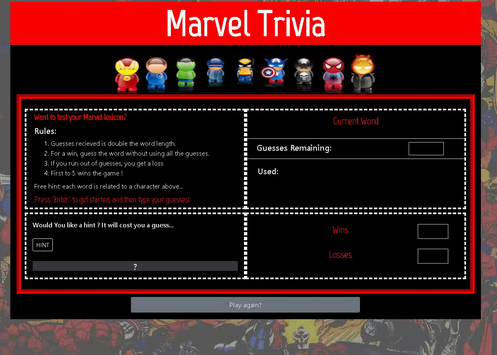

## Javascript Word Guess
This is a Marvel themed word guessing game. It is inspired by the classic 'hangman' game and is my first project using javascript to create an interactive web application. 

## Motivation
Desigining a game was an excellent way to practice fundamental javascript logical operators, especially in conjunction with a user interface. This provided an introduction to designing projects that work and provide good user experience. Furthermore, this project was also designed to store points and display previously chosen letters to the user, which required using a simple cache. 
 
## Screenshots

## Tech/framework used

<b>Built with</b>
- [HTML
- CSS 
- Javascript

## Features
Although this is a simple application, I decided to implement some rudimentary object oriented design. This allowed me to keep my code concise by defining one 'game' object and have the application's functionliaty as submethods of it. This made debugging easier and gave the codebase an overall cleaner look. 

## Resolutions
When developing this game I realized that, when choooisng a random index from an array, the same value can be chosen quite often if the set of values is relatively small. This is a problem if the program should run without duplicate values, like in a word guessing game where random words are gathered from an array. I solved this by deleting the value of an array after it was chosem, therefore eliminating the chance of duplicates. 

## Instructions
* Press Enter to start
* Guess letters in the word; the amount of guesses you have is double the length of the word
* Use a hint if you need it, but it costs a guess
* Get the word without running out of guesses and you get a point, otherwise computer gets a point
* First to 5 wins

### Live Look
[Marvel Word Guess](https://davidlapadula.github.io/Word-Guess-Game/)
